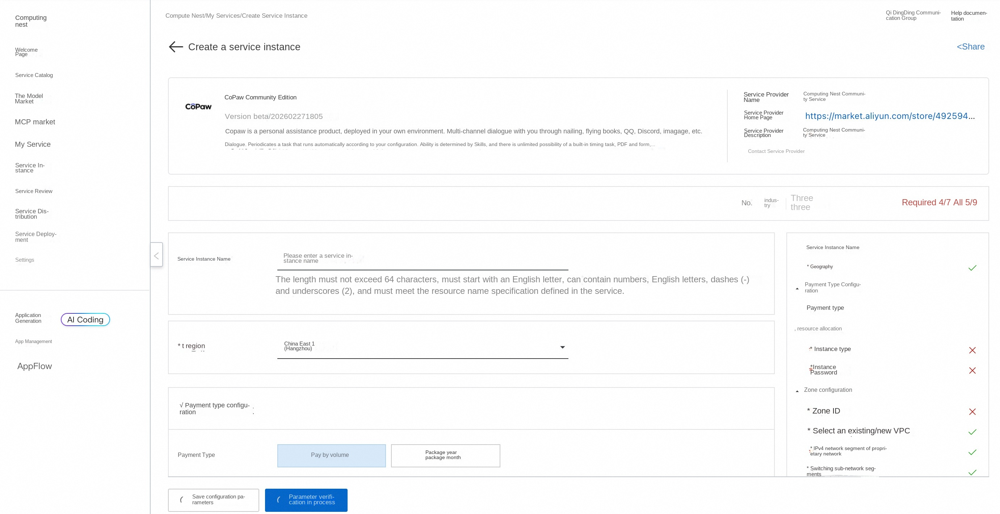
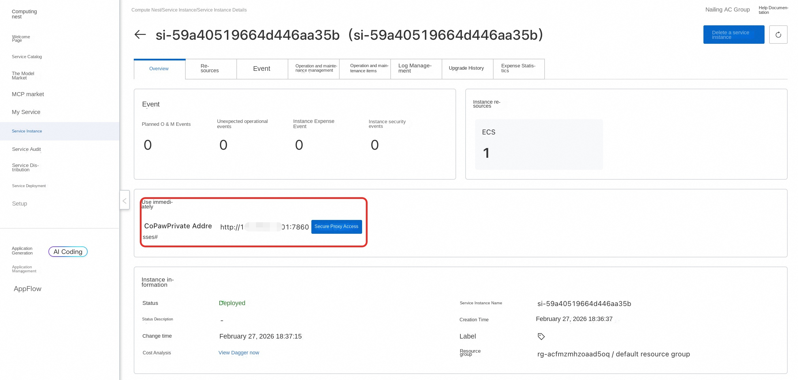
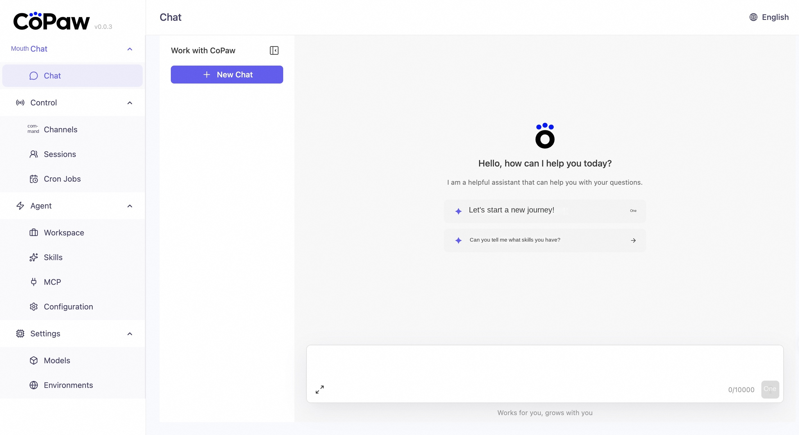
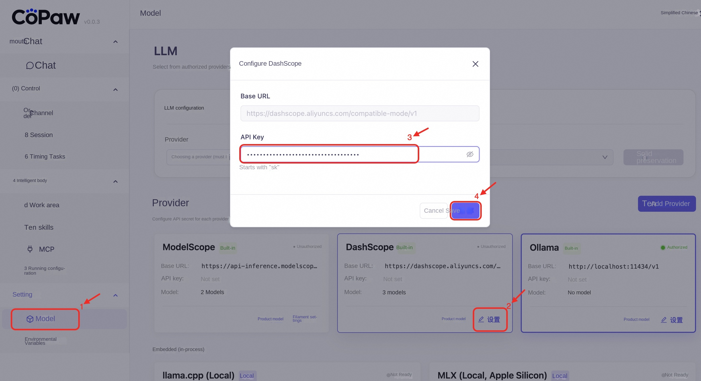
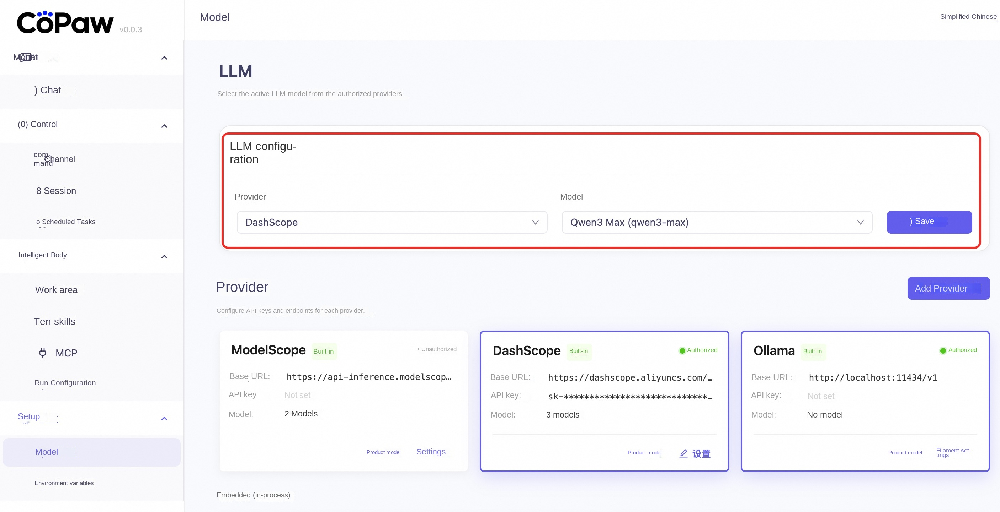
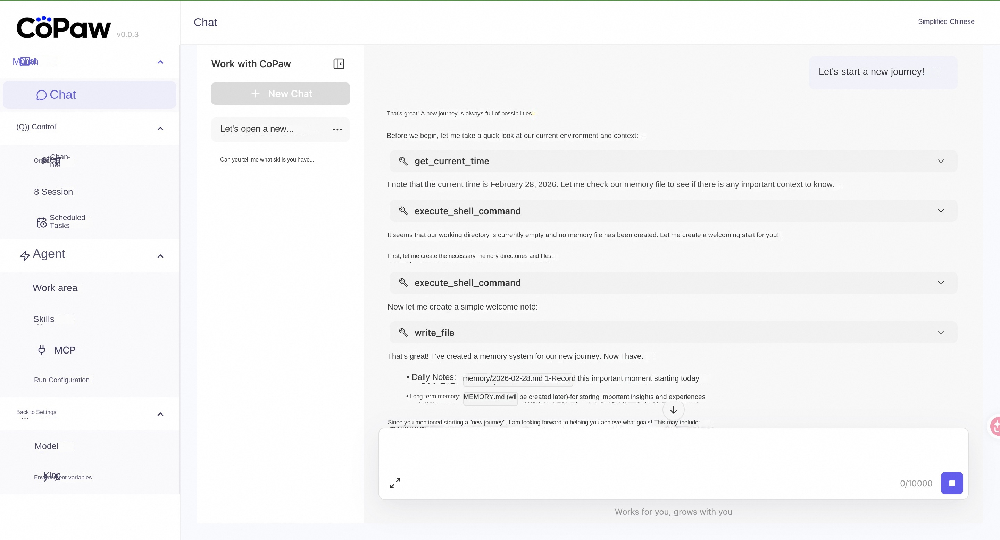
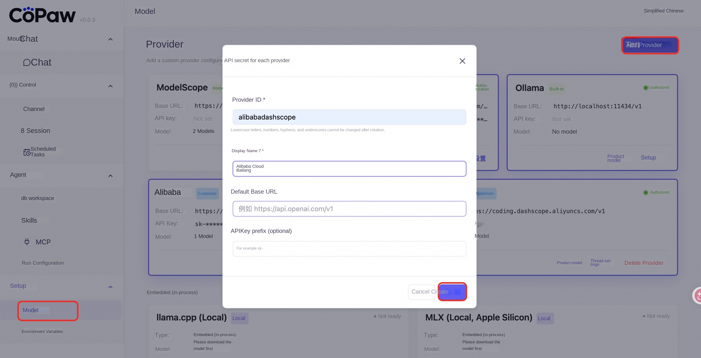
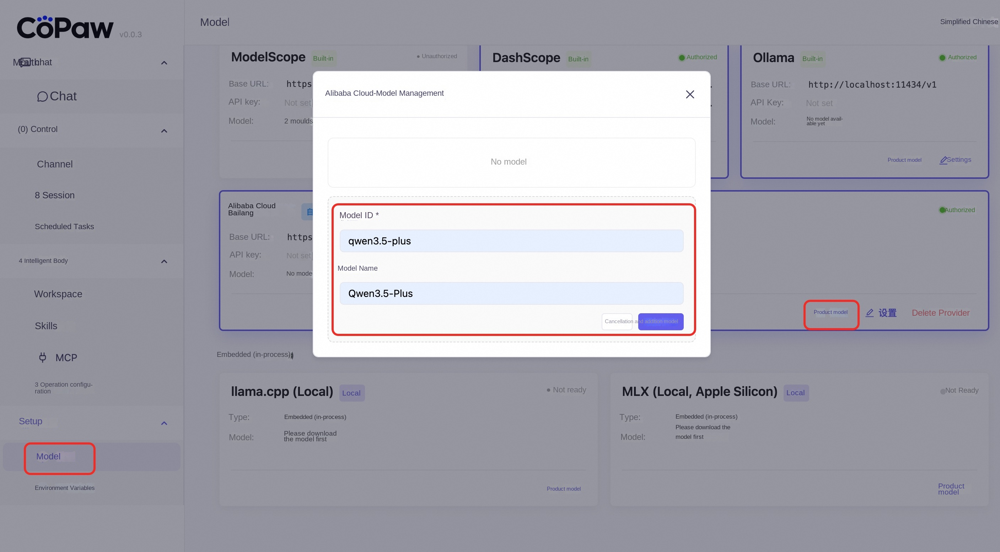
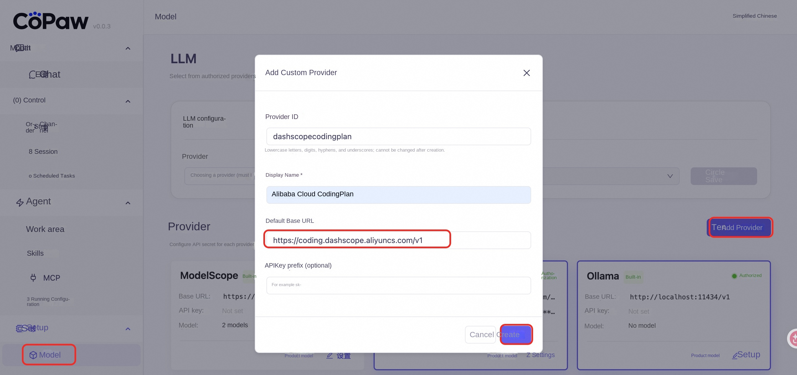

#🐾CoPawService Introduction

CoPAWs are personal assistance products, deployed in your own environment:
Multi-channel dialogue-through nailing, flying books, QQ, Discord, iMessage and other dialogue with you.
Timed execution-Automatically run tasks according to your configuration.
Capabilities are determined by Skills, with unlimited possibilities-built-in timed tasks, PDF and forms, Word/Excel/PPT document processing, news summaries, document reading, etc., and can be customized and expanded in Skills.
The data is all local-not dependent on third-party hosting.

##🚀Designing process

1. Visit the CoPawcommunity version of the computing nest [deployment link](https://computenest.console.aliyun.com/service/instance/create/cn-hangzhou?type=user&ServiceId=service-1ed84201799f40879884) and fill in the deployment parameters according to the page prompt:

2. After the parameter configuration is completed, the system will automatically generate **cost estimation details**. After confirming that there is no error, click **Next: Confirm Order**.

3. On the order confirmation page, check the instance information and expenses, and click * * Create Immediately * * to start automatic deployment.

4. Access address obtained after deployment:

5. Access Services:

6. Configuration of Bailian API_KEY([Get Bailian API_KEY](https://bailian.console.aliyun.com/cn-beijing/?tab=globalset#/efm/api_key)):

7. Configuration model:

8. Opening Dialogue:

##📚Use Guide

Please refer to CoPaw [official document](https://copaw.agentscope.io/docs/intro) to understand the complete function.

## Question feedback

In case of software Bug, can be solved through the following contact.

##❓Common problems
### How to configure other models
Settings> Model> Add Provider, enter the service provider information and click Create:
Base_Url: https://dashscope.aliyuncs.com/compatible-mode/v1

Add model:

After the API KEY is set, you can talk to the added model.

### How to configure the CodingPlan
Settings> Model> Add Provider, enter the service provider information and click Create:
CodingPlan_Base_Url: https://coding.dashscope.aliyuncs.com/v1

Add models and configure [100 Refinery CodingPlan API KEY](https://bailian.console.aliyun.com/cn-beijing/?apiKey=1&tab=model#/efm/coding_plan) to start the dialogue.
