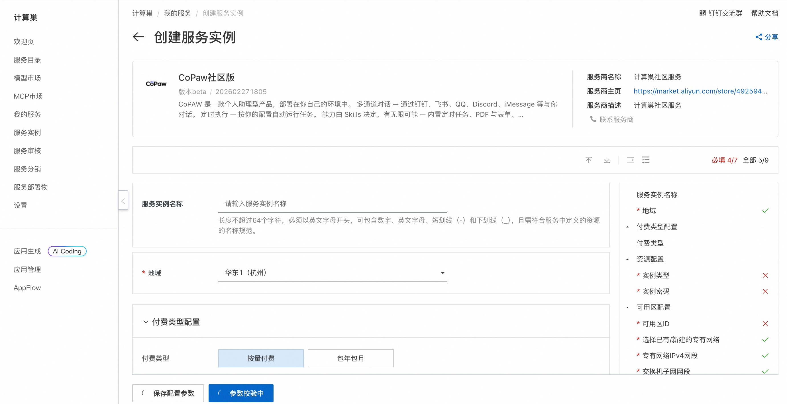
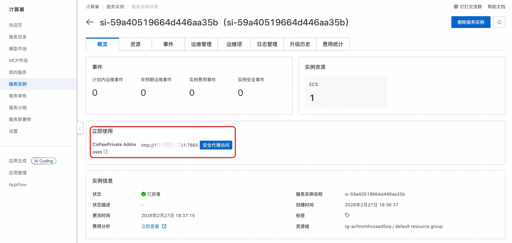
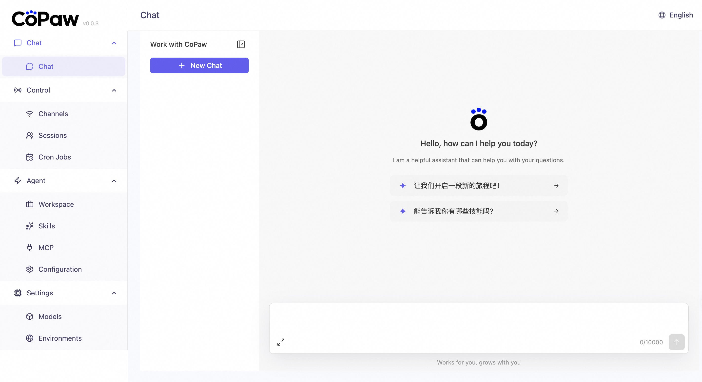
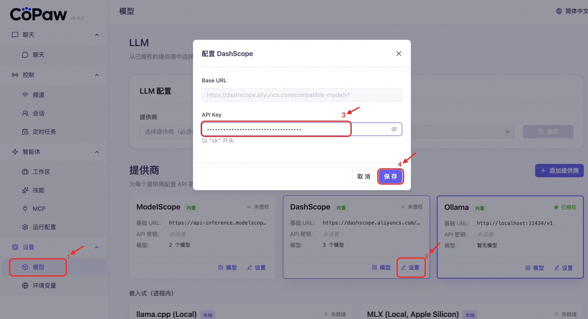
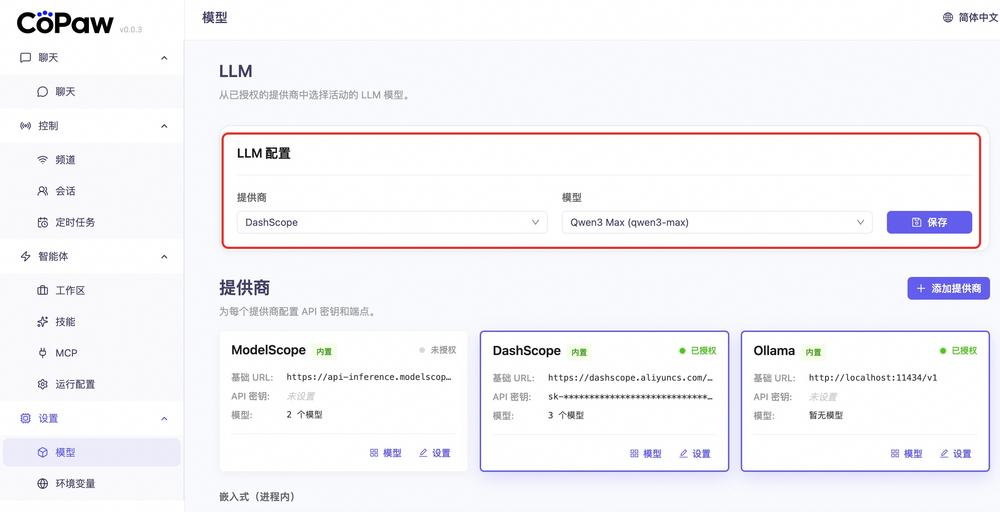
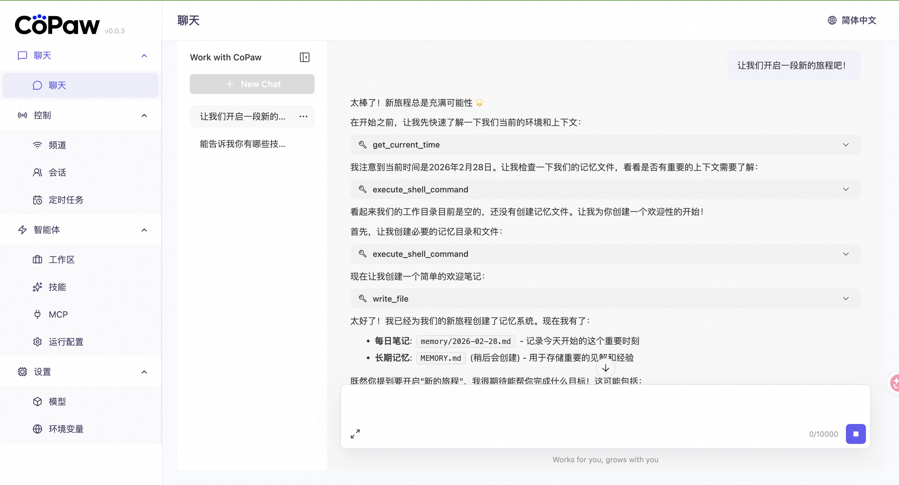
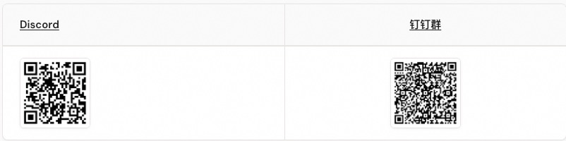
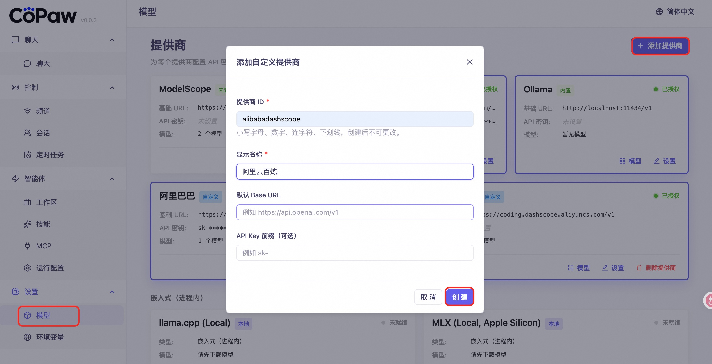
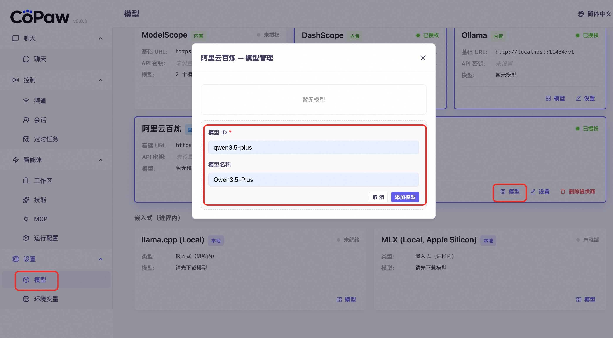
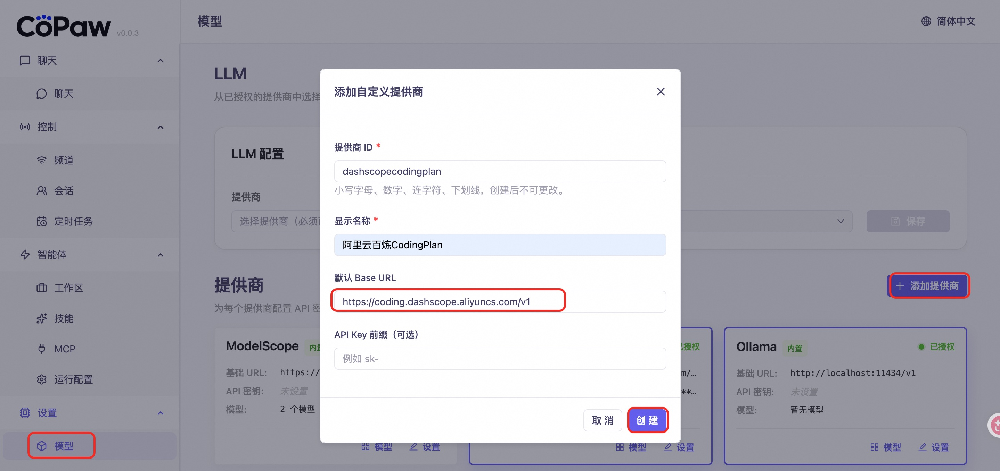

# 🐾 CoPaw 服务简介

CoPAW 是一款个人助理型产品，部署在你自己的环境中:
    多通道对话 — 通过钉钉、飞书、QQ、Discord、iMessage 等与你对话。
    定时执行 — 按你的配置自动运行任务。
    能力由 Skills 决定，有无限可能 — 内置定时任务、PDF 与表单、Word/Excel/PPT 文档处理、新闻摘要、文件阅读等，还可在 Skills 中自定义扩展。
    数据全在本地 — 不依赖第三方托管。

## 🚀 部署流程

1. 访问计算巢 CoPaw 社区版 [部署链接](https://computenest.console.aliyun.com/service/instance/create/cn-hangzhou?type=user&ServiceId=service-1ed84201799f40879884)，按页面提示填写部署参数：  
    

2. 参数配置完成后，系统将自动生成**费用预估明细**。确认无误后点击 **下一步：确认订单**。

3. 在订单确认页，核对实例信息与费用，点击 **立即创建** 开始自动部署。

4. 部署完成后获取访问地址：  
    

5. 访问服务：
    

6. 配置百炼API_KEY（[获取百炼API_KEY](https://bailian.console.aliyun.com/cn-beijing/?tab=globalset#/efm/api_key)）:
    

7. 配置模型：
    

8. 开始对话：
    

## 📚 使用指南

使用请参考 CoPaw [官方文档](https://copaw.agentscope.io/docs/intro) 了解完整功能。

## 问题反馈

遇到软件的Bug，可通过以下方式联系解决。
    

## ❓常见问题
### 如何配置百炼其他模型
设置>模型>添加提供商，输入服务商信息后点击创建：
Base_Url： https://dashscope.aliyuncs.com/compatible-mode/v1

添加模型：

配置百炼API KEY后选择添加的模型即可对话。

### 如何配置百炼CodingPlan
设置>模型>添加提供商，输入服务商信息后点击创建：
CodingPlan_Base_Url： https://coding.dashscope.aliyuncs.com/v1

添加模型并配置[百炼 CodingPlan API KEY](https://bailian.console.aliyun.com/cn-beijing/?apiKey=1&tab=model#/efm/coding_plan)后开启对话。
